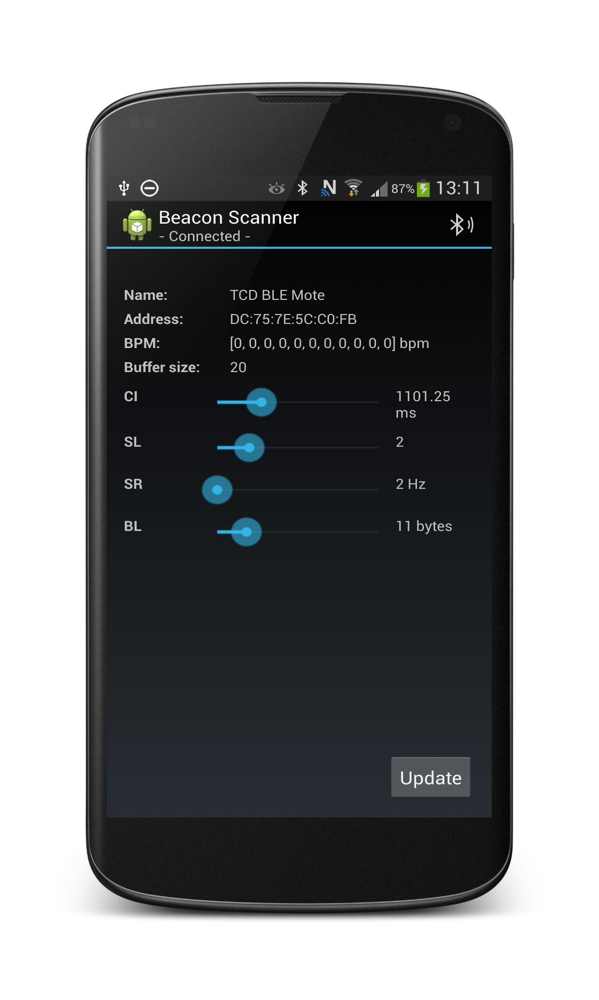

BeaconScanner
============

The Android counter part to the BLE_Arduino project.  
This project as well as the BLE_Ardunio project are part of a Master dissertation
developing an approach for a energy efficient Body Area Network. This is tried to be achieved by situation and context adaptive behaviour.

This app does not do too much it is mend as a demonstration element only.  
It searches and connects to an available Bluetooth low energy device and listens to updates of specific characteristics.  

It also can send changes to  characteristics that represent connection interval, slave latency, sampling rate and buffer limit. The application can control the embedded devices's behaviour through this characteristic values changes.

 

